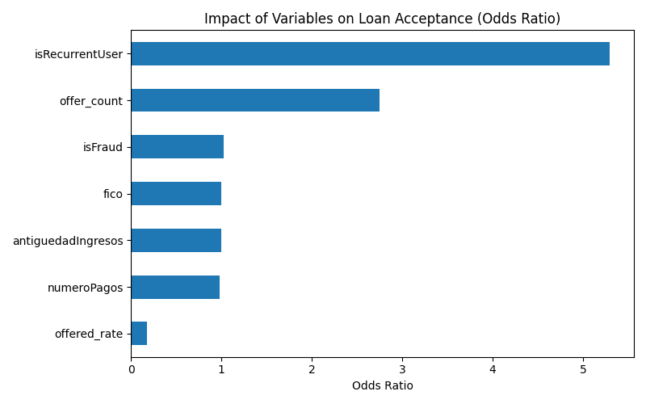
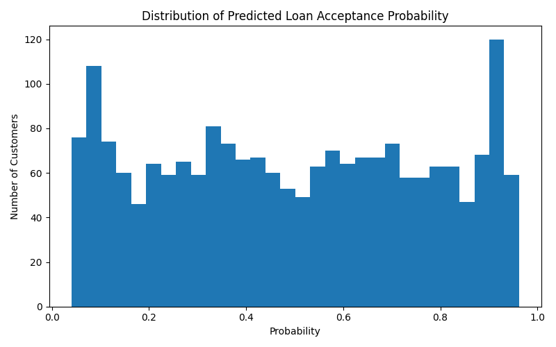
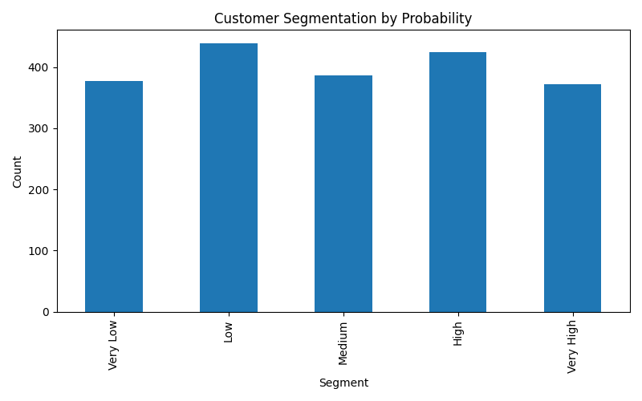

# Fintech Customer Conversion Analytics
Predicting Loan Acceptance & Optimizing Conversion Strategy

## Executive Summary

This project showcases a predictive analytics framework inspired by a real-world fintech engagement. The objective was to understand what drives loan acceptance and how customer-level probability scoring can support smarter conversion strategies.

The analysis shows that behavioral and engagement variables can be more informative than traditional financial signals alone, enabling more targeted and efficient decision-making.

## Business Problem

Fintech companies often need better visibility into:

- Which customers are most likely to accept a loan
- What factors influence customer conversion
- How to prioritize outreach and optimize acquisition efforts

Without a structured scoring framework, conversion strategies can become too broad and inefficient.

## Analytical Approach

- Synthetic data generation based on a real-world project structure
- Logistic Regression model for loan acceptance prediction
- Customer-level probability scoring
- Conversion segmentation for prioritization
- Visual analysis of key drivers and probability distribution

## Key Insights

- Customer engagement variables are strong predictors of conversion
- Returning users are more likely to accept offers
- Pricing and loan structure can influence customer decision-making
- Customers can be segmented into actionable probability groups

## Business Impact

This framework can help fintech companies:

- Prioritize high-probability customers
- Improve conversion efficiency
- Reduce acquisition waste
- Support more predictive and targeted strategies

## Visual Insights

### Key Drivers

### Probability Distribution

### Customer Segmentation

## Data

The original client dataset is confidential and cannot be shared.

To preserve confidentiality while demonstrating the full analytical workflow, a synthetic dataset was created to mirror the structure of the original business problem.

## Disclaimer

This repository is based on a real-world fintech use case. All company identifiers, sensitive details, and original data have been removed or anonymized.

## Author

**Denisse Pareja**  
Data Analyst | Fintech & Healthcare Analytics | Predictive Modeling  

I help organizations transform data into actionable business decisions, with a focus on customer behavior, conversion analytics, and operational performance.

🔗 LinkedIn: https://www.linkedin.com/in/denissepareja/ 
🔗 GitHub: https://github.com/denpareja/denissepareja
